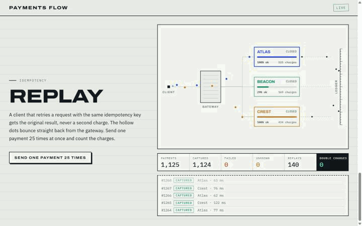

# Payments Flow
n[](https://bella.taile86535.ts.net:10000/payments-flow/)

A mock payment gateway with health-scored provider routing, circuit breakers and idempotent retries, drawn as a scroll-driven 3D particle flow. Each particle is a real payment moving through the code, and the page shows a counter that must always read zero: double charges.



Most payment-routing demos are diagrams. This one runs the routing: three mock providers that fail, decline and lose responses on command, a router that shifts traffic by observed health, and a retry policy built so a lost response can never charge a card twice. The live counters come from the same event stream that draws the particles.

## Tech stack

- **Backend:** Node.js 20+, TypeScript, `node:http` and `fetch`, [`ws`](https://github.com/websockets/ws) for the event stream
- **Frontend:** Vite, Three.js (custom point-sprite shaders), [Lenis](https://github.com/darkroomengineering/lenis) for smooth scroll, no UI framework
- **Tests:** `node:test` run through `tsx`, including a chaos test that fires duplicate keys at providers that fail and lose replies
- **CI:** GitHub Actions: typecheck, tests, production build

## Architecture

```
 browser (Three.js scene + controls)
    │  WebSocket /events ◄── routed · attemptFailed · settled · replayed · failed · unknown · tick
    │  POST /api/*       ──► payments, replay, provider tuning, traffic
    ▼
 PaymentService
    ├─ idempotency   one Promise per key; a repeat (in flight or finished) shares the first result
    ├─ HealthRouter  pick a provider at random, weighted by score^3 (success rate, then latency)
    │                 circuit breaker per provider: 4 failures in a row opens it for 3 s, then one probe
    └─ retry policy  definite failure (declined, 5xx)  → charged nothing  → may fail over
                     timeout / lost response           → outcome unknown  → retry the SAME provider, same key
    ▼
 MockProvider × 3    idempotent on key; can decline, return 5xx, or charge and then lose the reply
```

- **The retry rule is the point.** A decline means nothing was charged, so the next attempt can go to another provider. A timeout is different: the provider may already have charged. The gateway then retries only that provider with the same idempotency key, which returns the original charge. Failing over there could charge the card twice. If retries still can't confirm, the payment ends as `unknown` (needs reconciliation) rather than guessing.
- **Double charges are measured, not assumed.** The service counts idempotency keys charged by more than one provider. That number is shown on the page and asserted to be 0 in the tests.
- **Mutation-checked.** With the same-provider rule removed, the lost-response test and the chaos test both fail, so the tests do guard the invariant.
- **Scene.** One Three.js scene is pinned behind the page and scroll blends between camera stops. Cluster brightness follows provider health, an open breaker scatters its cluster, captured payments fly to the ledger bar, and replayed keys bounce back from the gateway ring. Entering a chapter sets up its scenario (for example, Beacon starts declining 90% of charges).
- **Simulated fallback.** If the page can't reach the server (for example on a static host), it runs the same `PaymentService` and `MockProvider` code inside the browser. The header then reads **SIMULATED · IN YOUR BROWSER** instead of **LIVE**.

## Key features

- Health-scored routing that visibly drains traffic from a degrading provider, with a floor so it is still sampled and can recover.
- Per-provider circuit breaker with open, half-open (single probe) and closed states, covered by unit tests.
- Idempotency keys that dedupe both concurrent and later repeats. Sending one key 25 times at once produces one charge.
- Failure injection from the page: provider decline rate, and the rate at which a provider charges but loses its reply.
- A live ledger: payments, captured, failed, unknown, replays and double charges.
- Works without WebGL (the page and controls still work) and respects `prefers-reduced-motion`.

## Setup

Requires Node 20 or newer (or Docker: `docker compose up -d --build` serves it on 127.0.0.1:8200).

```bash
npm install
npm start          # builds the frontend and serves everything on http://localhost:8080
```

For development with hot reload (server on :8080, Vite on :5173):

```bash
npm run dev
```

Other scripts:

```bash
npm test           # unit, concurrency, chaos and HTTP/WebSocket tests
npm run lint       # tsc --noEmit
npm run build      # production frontend into web/dist
```

### HTTP API

Send a payment (the `Idempotency-Key` header is optional; repeat it to get the original result):

```bash
curl -X POST localhost:8080/api/payments \
  -H 'content-type: application/json' -H 'idempotency-key: order-42' \
  -d '{"amount": 2500}'
# e.g. {"id":1,"key":"order-42","status":"captured","provider":2,"attempts":1}
```

| Method | Path | Body | Purpose |
| --- | --- | --- | --- |
| GET | `/api/state` | | Providers (score, circuit, charges, tuning), config and counters |
| POST | `/api/payments` | `{ amount, key? }` | One payment; `Idempotency-Key` header or `key` sets the key |
| POST | `/api/replay` | `{ n }` | Send one new key `n` times at once; returns how many charges happened |
| POST | `/api/providers/:id` | `{ failureRate?, lostResponseRate?, latencyMs? }` | Tune a mock provider |
| POST | `/api/config` | `{ rps?, duplicateRate? }` | Synthetic traffic rate and the share of repeated keys |
| WS | `/events` | | Stream of `PayEvent` (see [`shared/types.ts`](shared/types.ts)) |

## Limitations

- Providers are mocks with random failures and delays. There is no real money, card data or network to a payment processor.
- State is in memory: idempotency keys and charges are lost on restart and trimmed after about 6,000 keys. A real system needs a durable store with a TTL.
- `unknown` payments are only counted. There is no reconciliation job that later asks the provider what happened.
- Routing weights and breaker thresholds are fixed constants, not tuned against real traffic.
- Synthetic traffic is capped at 80 payments per second to keep the scene readable. Not load-tested.

## Why I built this

I wanted to show the part of payment routing that is easy to get wrong: what to do after a timeout. The gateway, its retry rule and its counters are real code you can break from the page, instead of a diagram of how it ought to work.
